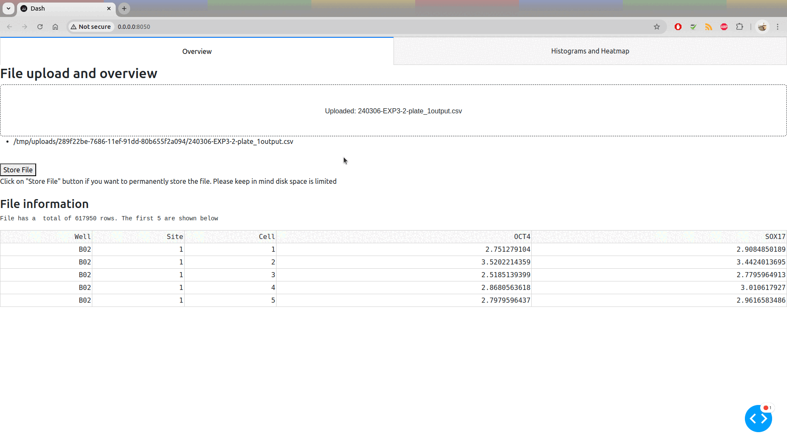

# High Throughput Microscopy Dashboard

This web app facilitates the analysis and visualization of high throughput microscopic data. 

The data is offered as a table where separate measurements are stored in columns. User uploads the table and the app outputs plots and tables. The app assumes a specific structure in the that table.  

There are two tabs in the app: The first tab provides the interface to upload the file and, after the upload completes, some basic info about the file is displayed. The second tab displays the histograms of the intensities of OCT4 and SOX17. The user can then select the threshold for each intensity above which a cell is considered positive. There are two heatmaps on display, which are a visualization of a plate with its wells, annotated with row and column IDs. The first heatmap diplays the total cell counts per well. The second the percentage of cells that are above the user set OCT4 and SOX17 thresholds. 

## How to run
* Clone the git repo
* Build the docker image by running something like `docker build -t dashboard:latest .`
* Run the image with something like `docker run -p 8050:8050 dashboard:latest `
* Connect to it from your browser

## Demo

## Future work
* Adaptable to input format
* Code modular, easy to maintain and tested
* Addapt according to end user feedback
* Part of a bigger project 